# Analyse de sentiment Twitter : Construction d'un système de prédiction avec une approche MLOps

## Problématique

Air Paradis, compagnie aérienne, a sollicité notre cabinet MIC pour développer un outil capable de prédire le sentiment lié à un tweet.  
**L'objectif : anticiper les bad buzz avant qu'ils ne deviennent viraux.**

Ce blog revient sur les différentes étapes du projet, de l'expérimentation des modèles jusqu'au déploiement en production.

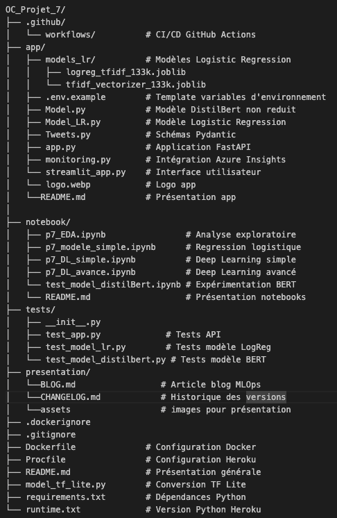  
*Architecture du projet sur GitHub*

---

## Sommaire

1. [Données et exploration](#données-et-exploration)  
2. [Expérimentation et modélisation](#expérimentation-et-modélisation)  
3. [Le défi TensorFlow Lite](#le-défi-tensorflow-lite)  
4. [Architecture MLOps](#architecture-mlops)  
5. [Monitoring et alerting](#monitoring-et-alerting)  
6. [Déploiement et production](#déploiement-et-production)  
7. [Résultats finaux](#résultats-finaux)  

---

## Données et exploration

La première étape consiste à explorer le dataset pour comprendre la nature des données.

**Dataset** : [Sentiment140 (Kaggle)](https://www.kaggle.com/datasets/kazanova/sentiment140)  

- 1,6 million de tweets répartis équitablement (positif / négatif)  
- Échantillon retenu : **50 000 tweets**

**Variables clés** :

- `target` : polarité (0 = négatif, 1 = positif)  
- `text` : contenu du tweet  
- `user`, `date`, `id` : métadonnées  

**Insights :**

- Distribution équilibrée des classes (50 / 50)  
- Longueur moyenne des tweets : 80–120 caractères  
- Présence de bruit (URLs, mentions, hashtags, dédoublement de lettres…)  

---

## Expérimentation et modélisation

Nous avons testé trois approches pour identifier le modèle optimal.  
Le choix final s'appuie sur la **précision**, métrique critique dans notre contexte, où les **faux positifs** (tweets négatifs prédits comme positifs) sont particulièrement problématiques pour la détection de bad buzz.

### Approche 1 : Modèles sur mesure simples

Trois stratégies de preprocessing testées :

1. **word_tokenize + lemmatisation**  
2. **TweetTokenizer + lemmatisation**  
3. **TweetTokenizer + stemming**

**Vectorisation** : TF-IDF (comptage pondéré des mots)

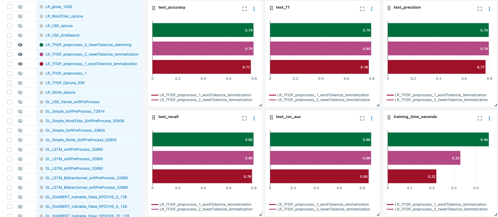

**Embeddings testés** :

- Word2Vec (pré-entraîné)  
- GloVe (pré-entraîné)  
- Universal Sentence Encoder (USE)  

> **Note :** Nous avons utilisé d’abord **GridSearchCV** pour explorer une petite grille d’hyperparamètres, puis **Optuna** pour élargir l’espace de recherche de manière plus efficace et adaptative.

**Insight principal :** le preprocessing a un impact plus significatif sur les performances que le choix de l'embedding lui-même.

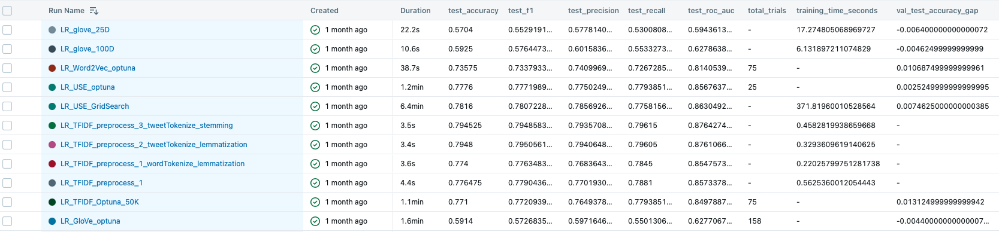

---

**Configuration commune à tous les modèles Deep Learning :**

Pour la suite des expérimentations, nous avons exploité le **GPU Apple M2** via TensorFlow pour macOS et l'extension `tensorflow-metal` afin d'accélérer l'entraînement.  
L'utilisation de `tf.data.Dataset` permet d'optimiser le pipeline de données, notamment grâce au **prefetching**, qui parallélise le chargement des batchs avec l'exécution du modèle.

Fonction `make_dataset`  

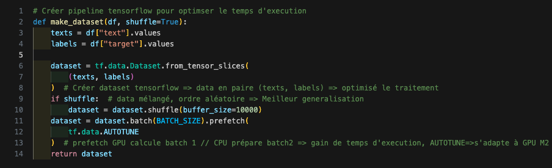

- **Optimiseur** : AdamW (Adam avec weight decay pour une meilleure régularisation)  
- **Callbacks** :  
  - `EarlyStopping` : arrêt anticipé si la validation loss stagne  
  - `ReduceLROnPlateau` : réduction du learning rate  
- **Dataset** : 50 000 tweets (70 % train / 15 % val / 15 % test)  

---

### Approche 2 : Approche sur mesure avancée

#### Modèle 1 : Deep Learning simple 

Nous avons testé **4 stratégies d'embeddings** pour évaluer l'impact de la représentation vectorielle sur les performances :

##### 1.1 Embedding entraîné sur le corpus

Architecture DL simple  

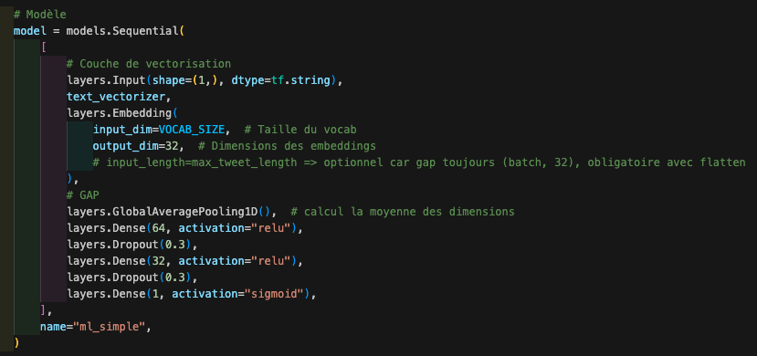

##### 1.2 Word2Vec (pré-entraîné)

- Chargement des embeddings Word2Vec (Google News, 100 dimensions)  
- `Embedding` initialisée avec les poids Word2Vec (`trainable=True`)  

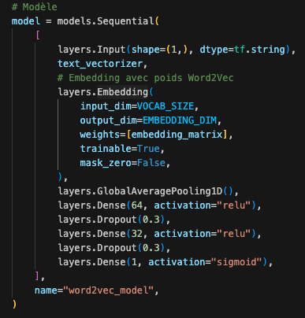

##### 1.3 GloVe (pré-entraîné)

- Chargement des embeddings GloVe (Twitter, 100 dimensions)  
- `Embedding` initialisée avec les poids GloVe (`trainable=True`)  

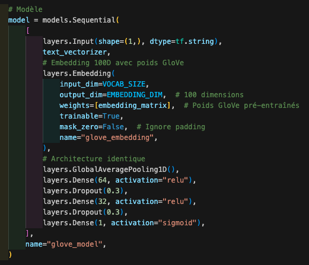

##### 1.4 Universal Sentence Encoder (USE)

- Chargement des embeddings USE (512 dimensions)  

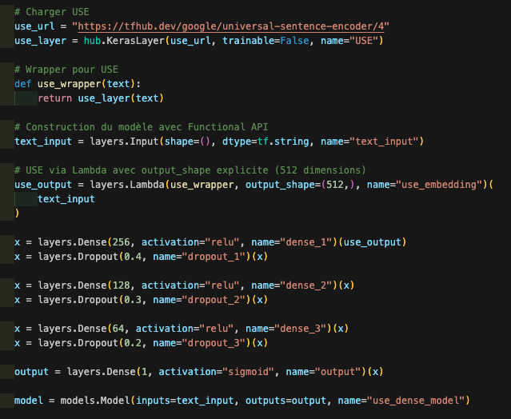

---

#### Modèle 2 : LSTM (Long Short-Term Memory)

Les LSTM permettent de capturer les **dépendances temporelles** dans les séquences de texte grâce à leur mécanisme de mémoire à long terme.

##### 2.1 LSTM  

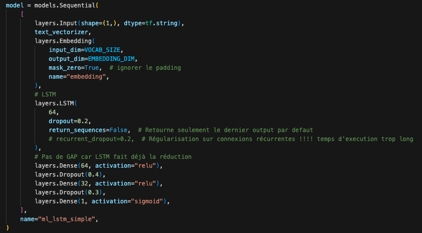

##### 2.2 LSTM bidirectionnel


**Comparaison des stratégies d'embedding + LSTM + BiLSTM :**

  

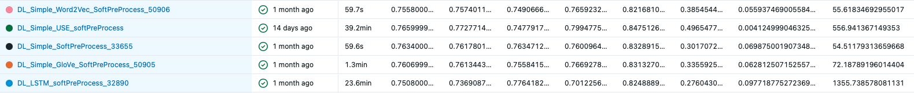

**Insights :**

- Resultats moyen pour ces modèles où l'accuracy varie entre 0.75 et 0.76 et la precision entre 0.74 et 0.77 pour les LSTM's  

---

### Approche 3 : Approche sur mesure avancée - DistilBERT

Version distillée de BERT (40 % plus léger, 60 % plus rapide, 95 % de performance).  
DistilBERT utilise un tokenizer et un encodage spécifiques.

Deux configurations testées :

- **Trainable = True** (fine-tuning complet)  

  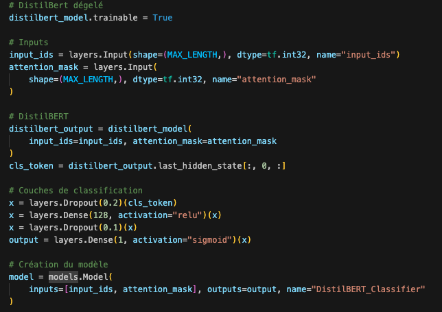  

  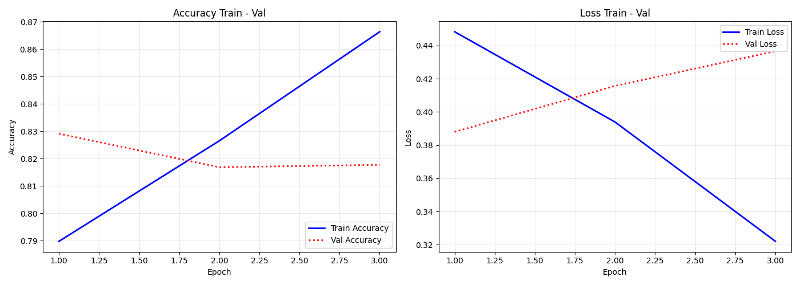  

  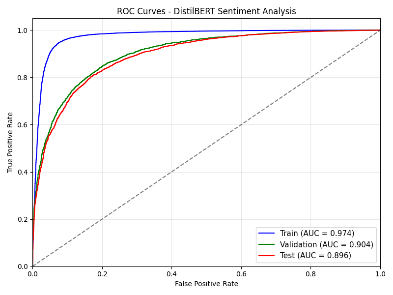

- **Trainable = False** (feature extraction)  

  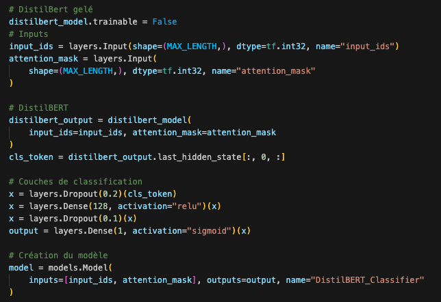  

  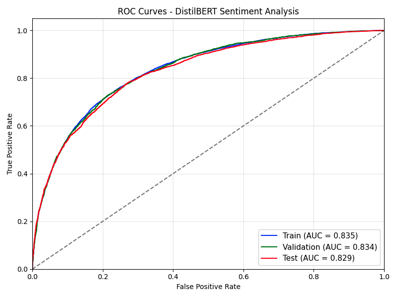  

  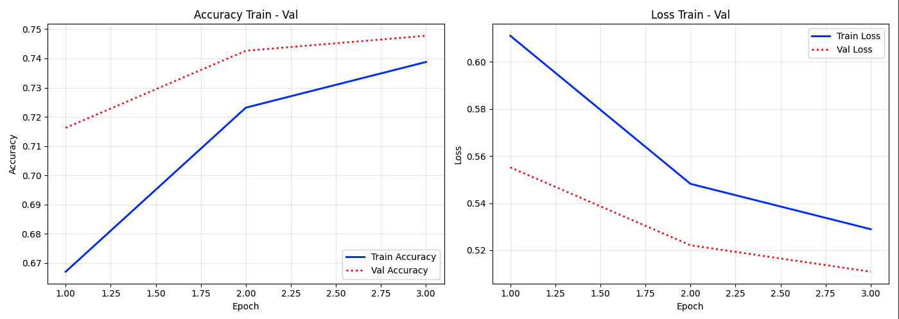

#### Résultats

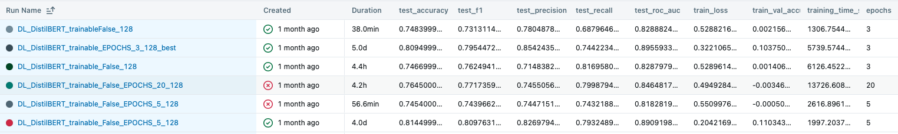

**Insights** : 

- Excellente capacité de discrimination entre classes (ROC-AUC : 0.89)  
- Gère mieux les **négations** ("I'm not unhappy" → positif ✅)  
- Comprend les **nuances, ironie**  
- Mieux adapté à l'univers Twitter  

---

## Le Défi TensorFlow Lite {#le-défi-tensorflow-lite}

Face au problème de taille du modèle DistilBERT (766 MB), nous avons tenté de le compresser via **TensorFlow Lite**.

### Tentative 1 : Conversion avec quantification dynamique

**Résultat** :

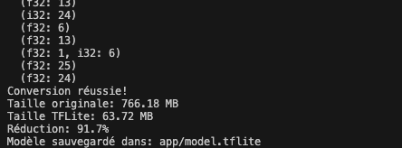

**Problème** : Modèle cassé ❌  

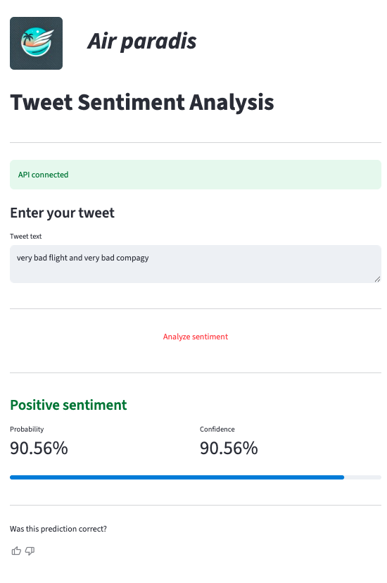

---

### Tentative 2 : Conversion sans optimisation

**Résultat** :

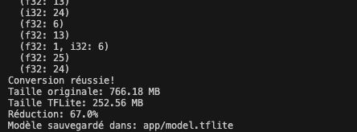

**Problème** : Modèle cassé ❌  


---

### Tentative 3 : Déployer le modèle sans réduction

**Résultat** : Limite Heroku (512 MB RAM) dépassée ❌  

---

### Abandon de TensorFlow Lite

**Conclusion** : TensorFlow Lite n'est pas adapté aux modèles Transformer pour notre cas d'usage.

---

## Choix Final du Modèle {#architecture-mlops}

Face à l'impossibilité de déployer DistilBERT, nous avons adopté une **approche pragmatique** : choisir le modèle offrant la meilleure précision après DistilBERT.

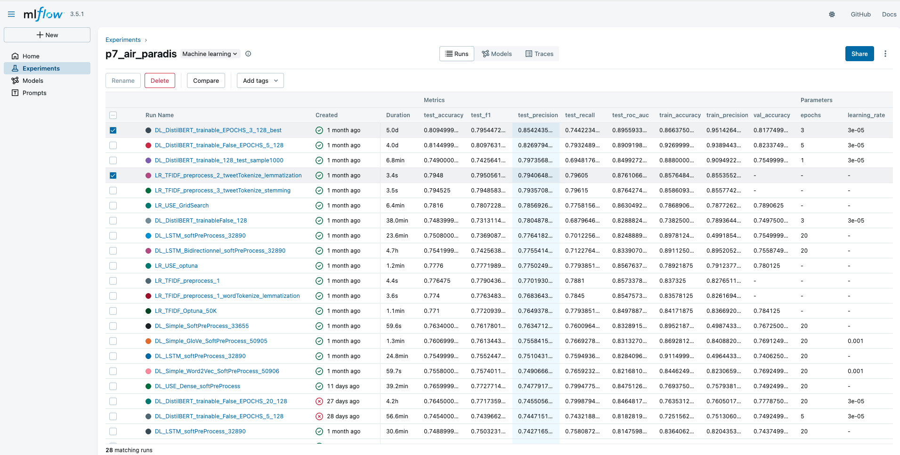

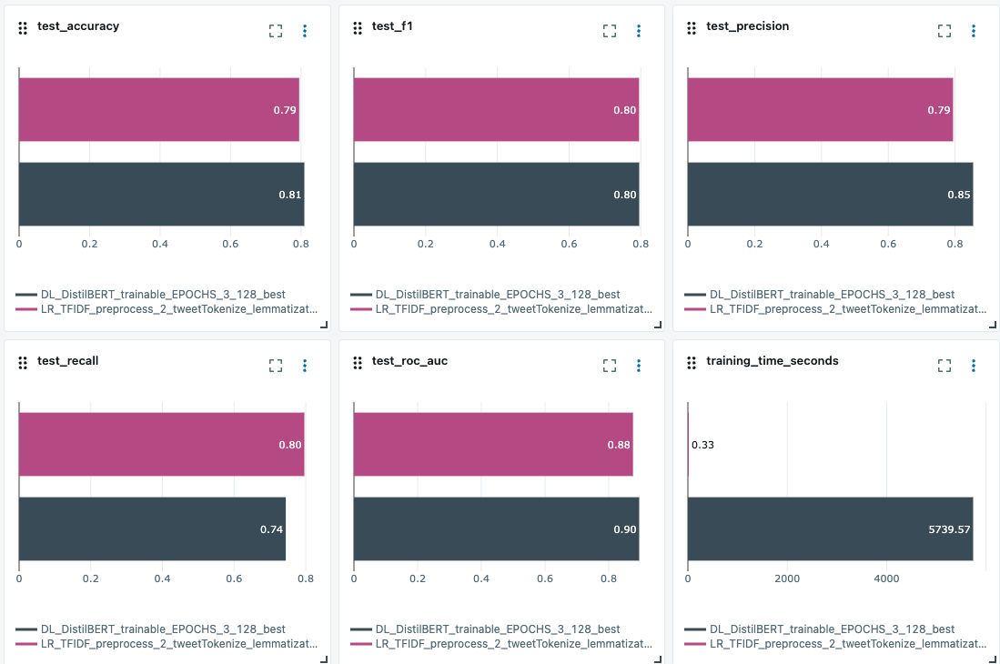

### Décision : Logistic Regression + TF-IDF

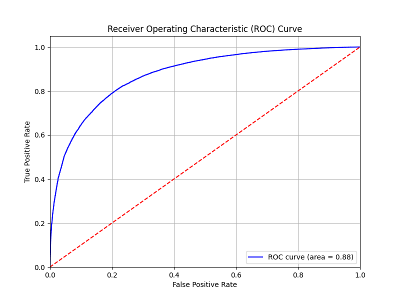


- Largement suffisant pour la détection de bad buzz  
- Déployable sur Heroku Free  
- Possibilité de ré-entraîner rapidement avec de nouvelles données  
- Pas de dépendances lourdes  

### Architecture du modèle retenu

**Pipeline complet** :
```python
# 1. Preprocessing
text → lowercasing → remove_punctuation → tokenization

# 2. Vectorisation TF-IDF
tokens → TfidfVectorizer(max_features=10000, ngram_range=(1,2))

# 3. Classification
vector → LogisticRegression(C=1.0, solver='lbfgs')
```