# Analyse de sentiment Twitter : construction d'un système de prédiction avec une approche MLOps

## Problématique

Air Paradis, compagnie aérienne, a sollicité notre cabinet MIC pour développer un outil capable de prédire le sentiment lié à un tweet.  
**L'objectif : anticiper les bad buzz avant qu'ils ne deviennent viraux.**

Ce blog revient sur les différentes étapes du projet, de l'exploration des données et de l'expérimentation des modèles jusqu'au déploiement en production.

*Architecture du projet*

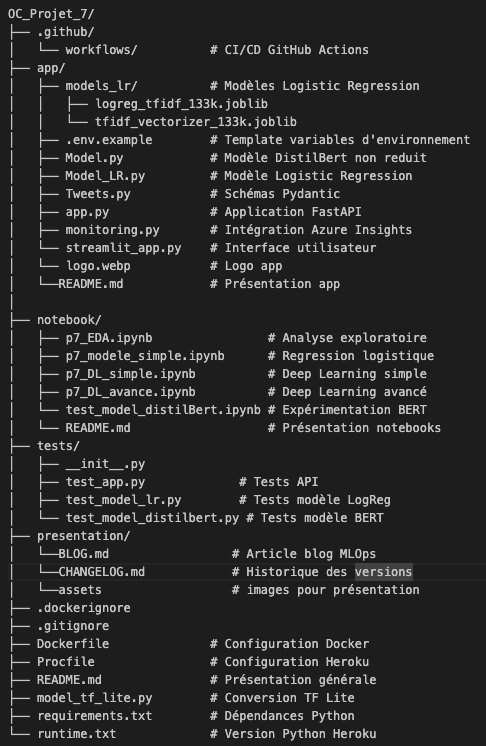  

---

## Sommaire

1. [Données et exploration](#données-et-exploration)  
2. [Expérimentation et modélisation](#expérimentation-et-modélisation)  
3. [Le défi TensorFlow Lite](#le-défi-tensorflow-lite)  
4. [Choix du modèle de production](#choix-du-modèle-de-production)  
5. [Déploiement et production](#déploiement-et-production)  
6. [Monitoring et alerting](#monitoring-et-alerting)  
7. [Conclusion](#conclusion)  

---

## Données et exploration

La première étape consiste à explorer le dataset pour comprendre la nature des données.

**Dataset** : [Sentiment140 (Kaggle)](https://www.kaggle.com/datasets/kazanova/sentiment140)  

- 1,6 million de tweets répartis équitablement (positif / négatif)  
- Échantillon retenu : **50 000 tweets**

**Variables clés** :

- `target` : polarité (0 = négatif, 1 = positif)  
- `text` : contenu du tweet  
- `user`, `date`, `id` : métadonnées  

**Insights :**

- Distribution équilibrée des classes (50 / 50)  
- Longueur moyenne des tweets : 80–120 caractères  
- Présence de bruit (URLs, mentions, hashtags, dédoublement de lettres…)  

---

## Expérimentation et modélisation

Nous avons testé trois approches pour identifier le modèle optimal.  
Le choix final s'appuie sur la **précision**, métrique critique dans notre contexte, où les **faux positifs** (tweets négatifs prédits comme positifs) sont particulièrement problématiques pour la détection de bad buzz.

### Approche 1 : Modèles sur mesure simples

Trois stratégies de preprocessing testées :

1. **word_tokenize + lemmatisation**  
2. **TweetTokenizer + lemmatisation**  
3. **TweetTokenizer + stemming**

**Vectorisation** : TF-IDF (comptage pondéré des mots)

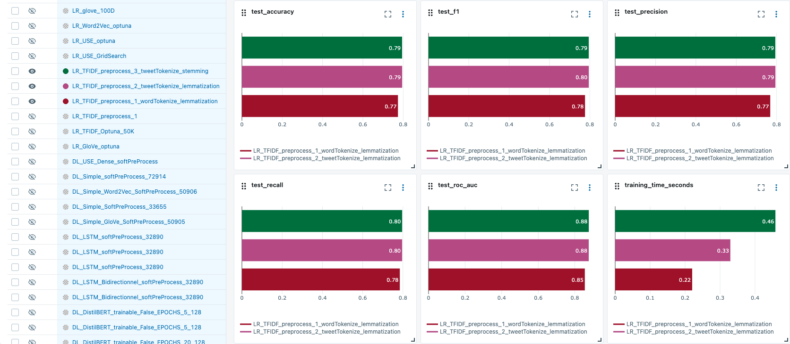

**Embeddings testés** :

- Word2Vec (pré-entraîné)  
- GloVe (pré-entraîné)  
- Universal Sentence Encoder (USE)  

> **Note :** nous avons d’abord utilisé **GridSearchCV** pour explorer une petite grille d’hyperparamètres, puis **Optuna** pour élargir l’espace de recherche de manière plus efficace et adaptative.

**Insight principal :** le preprocessing a un impact plus significatif sur les performances que le choix de l'embedding lui-même.

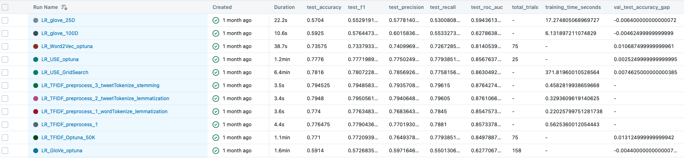

---

**Configuration commune à tous les modèles Deep Learning :**

Pour la suite des expérimentations, nous avons exploité le **GPU Apple M2** via TensorFlow pour macOS et l'extension `tensorflow-metal` afin d'accélérer l'entraînement.  
L'utilisation de `tf.data.Dataset` permet d'optimiser le pipeline de données, notamment grâce au **prefetching**, qui parallélise le chargement des batchs avec l'exécution du modèle.

Fonction `make_dataset`  

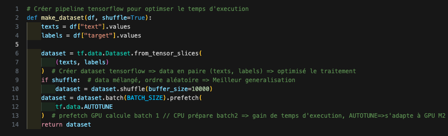

- **Optimiseur** : AdamW (Adam avec weight decay pour une meilleure régularisation)  
- **Callbacks** :  
  - `EarlyStopping` : arrêt anticipé si la validation loss stagne  
  - `ReduceLROnPlateau` : réduction du learning rate  
- **Dataset** : 50 000 tweets (70 % train / 15 % val / 15 % test)  

---

### Approche 2 : Approche sur mesure avancée

#### Modèle 1 : Deep Learning simple 

Nous avons testé **4 stratégies d'embeddings** pour évaluer l'impact de la représentation vectorielle sur les performances :

##### 1.1 Embedding entraîné sur le corpus

Architecture DL simple  

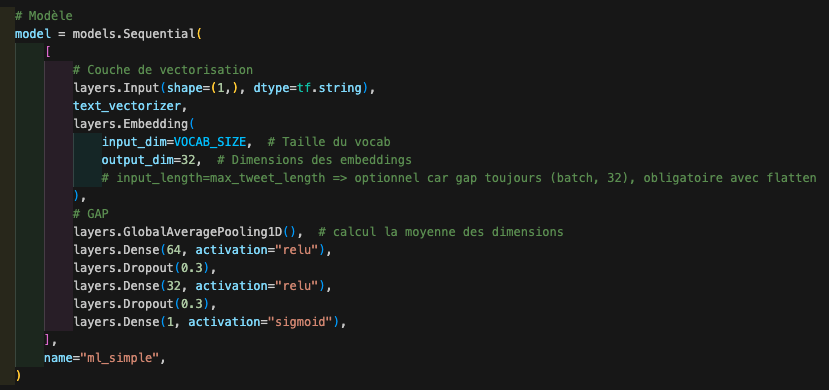

##### 1.2 Word2Vec (pré-entraîné)

- Chargement des embeddings Word2Vec (Google News, 100 dimensions)  
- `Embedding` initialisée avec les poids Word2Vec (`trainable=True`)  

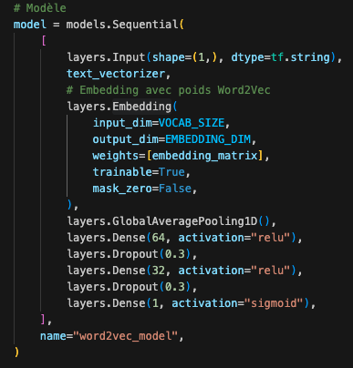

##### 1.3 GloVe (pré-entraîné)

- Chargement des embeddings GloVe (Twitter, 100 dimensions)  
- `Embedding` initialisée avec les poids GloVe (`trainable=True`)  

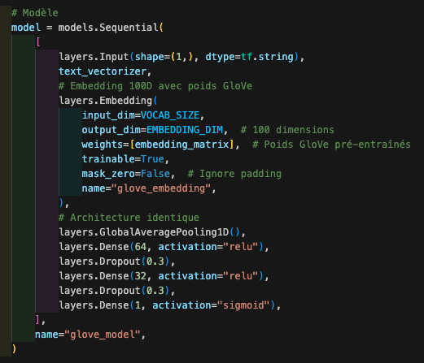

##### 1.4 Universal Sentence Encoder (USE)

- Chargement des embeddings USE (512 dimensions)  

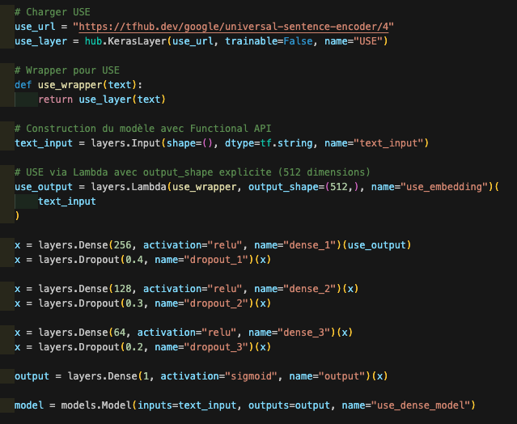

---

#### Modèle 2 : LSTM (Long Short-Term Memory)

Les LSTM permettent de capturer les **dépendances temporelles** dans les séquences de texte grâce à leur mécanisme de mémoire à long terme.

##### 2.1 LSTM  

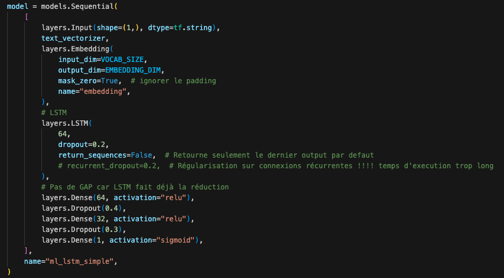

##### 2.2 LSTM bidirectionnel

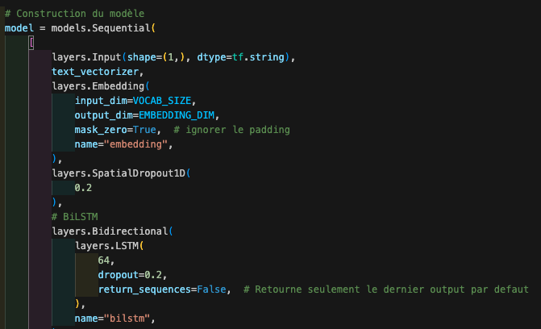

**Comparaison des stratégies d'embedding + LSTM + BiLSTM :**

  

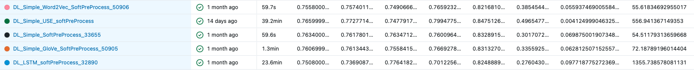

**Insights :**

- Résultats moyens pour ces modèles, avec une accuracy entre 0,75 et 0,76 et une précision entre 0,74 et 0,77 pour les LSTM.  

---

### Approche 3 : Approche sur mesure avancée – DistilBERT

Version distillée de BERT (40 % plus léger, 60 % plus rapide, 95 % des performances).  
DistilBERT utilise un tokenizer et un encodage spécifiques.

Deux configurations testées :

- **Trainable = True** (fine-tuning complet)  

  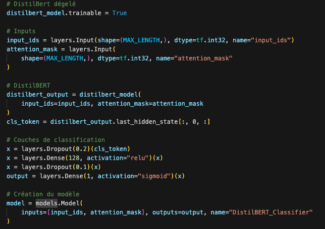  

  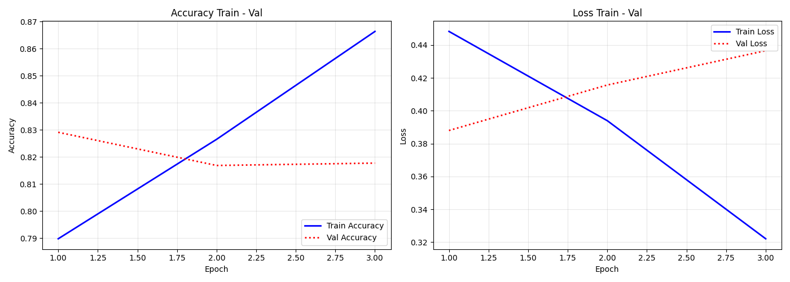  

  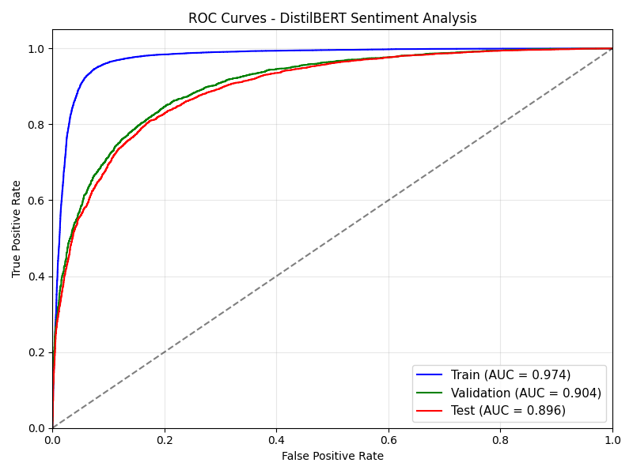

Note : à partir de la deuxième epoch, on observe que le modèle généralise moins bien : l’accuracy d’entraînement continue d’augmenter tandis que l’accuracy de validation diminue et que la loss de validation augmente. Cela indique le début d’un overfitting.  
→ **Deux epochs suffisent** pour ce cas.

- **Trainable = False** (feature extraction)  

  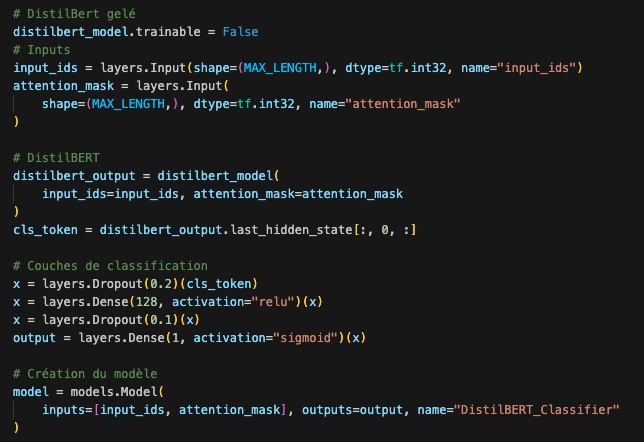  

  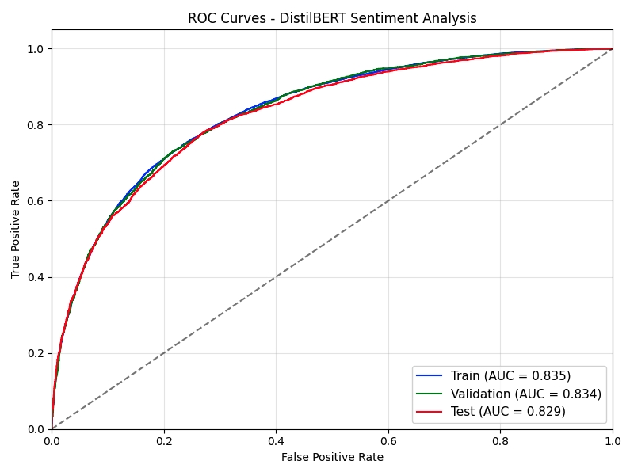  

  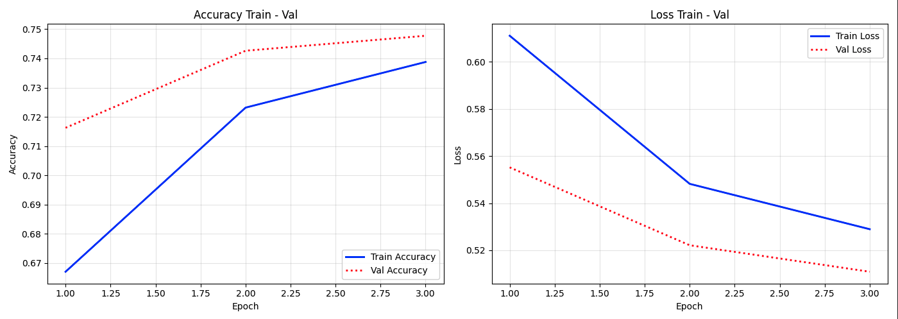

Note : sur ces courbes, l’accuracy d’entraînement et de validation augmentent toutes les deux tandis que les loss diminuent. L’accuracy de validation reste même légèrement supérieure à celle d’entraînement, ce qui indique que le modèle généralise bien et qu’il n’y a pas d’overfitting visible. Nous pouvons à ce stade expérimenter davantage d’epochs.

#### Résultats

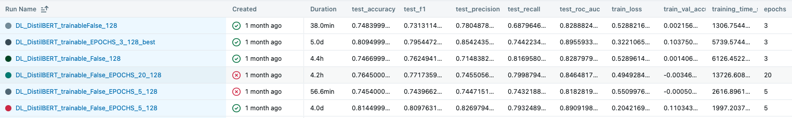

**Insights** : 

- Excellente capacité de discrimination entre classes (ROC-AUC : 0,89)  
- Gère mieux les **négations** ("I'm not unhappy" → positif ✅)  
- Comprend mieux les **nuances** et l’**ironie**  
- Mieux adapté à l'univers Twitter  

---

## Le défi TensorFlow Lite 

Face au problème de taille du modèle DistilBERT, nous avons tenté de le compresser via **TensorFlow Lite**.

### Tentative 1 : Conversion avec quantification dynamique

**Résultat** :

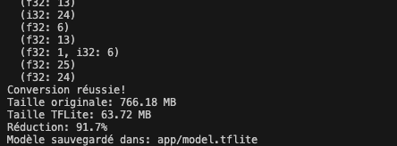

**Problème** : modèle cassé ❌  

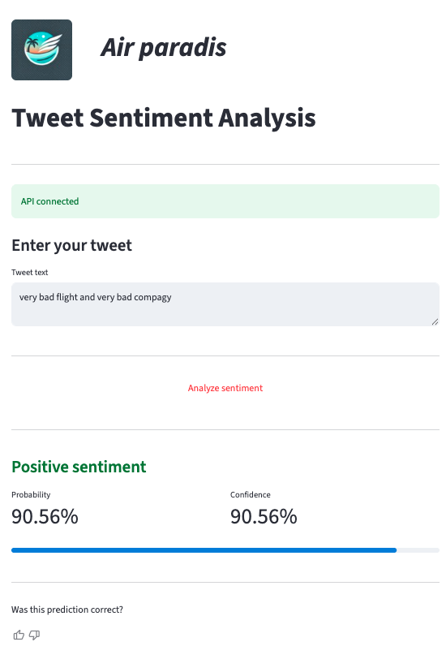

---

### Tentative 2 : Conversion sans optimisation

**Résultat** :

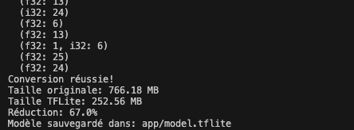

**Problème** : modèle cassé ❌  

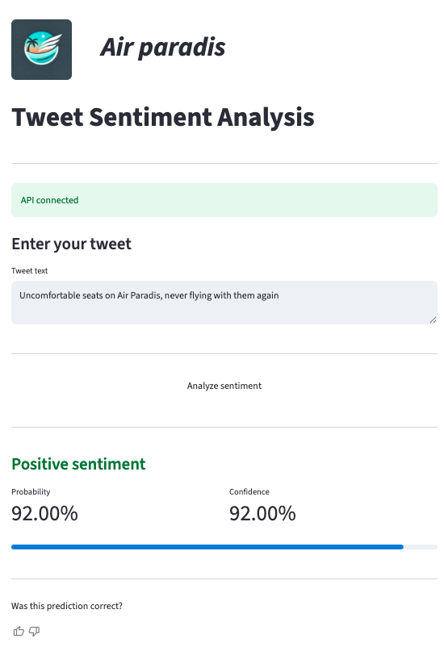

---

### Tentative 3 : Déployer le modèle sans réduction

**Résultat** : limite Heroku (512 MB) dépassée, modèle de 766 MB ❌  

---

### Abandon de TensorFlow Lite

**Conclusion** : TensorFlow Lite n'est pas adapté pour notre cas d'usage.

---

## Choix du modèle de production

Face à l'impossibilité de déployer DistilBERT, nous avons choisi le modèle offrant la meilleure précision après DistilBERT.

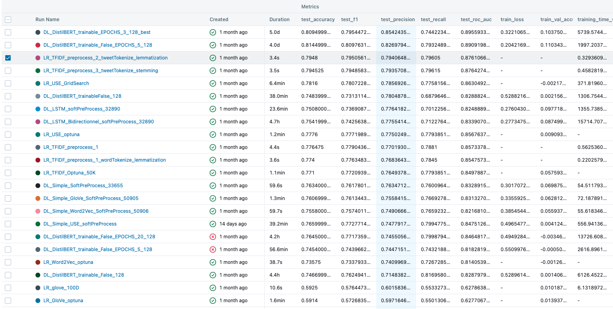

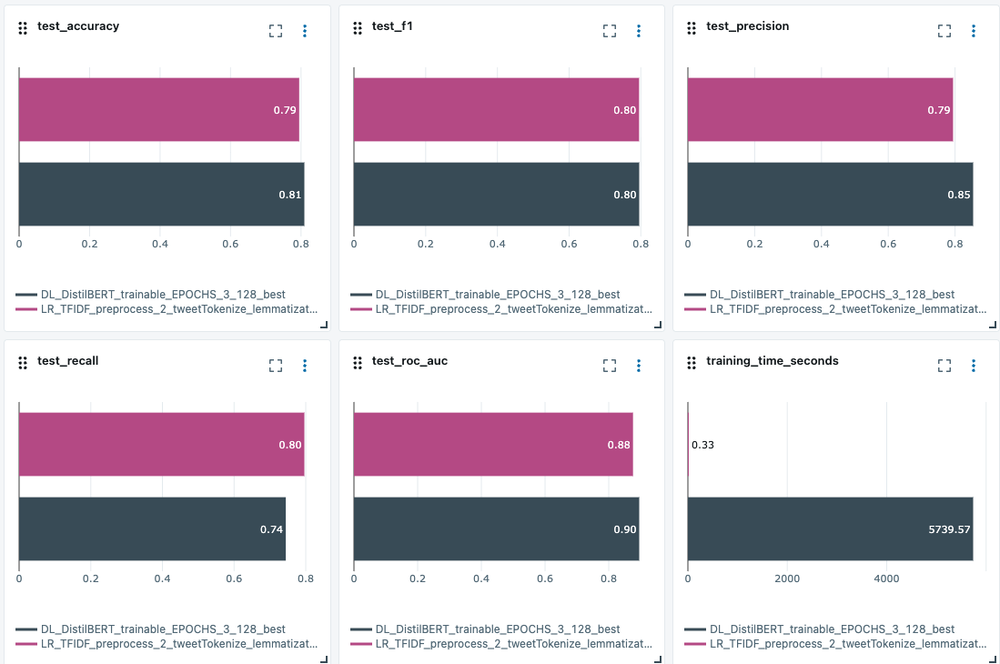

### Décision : Logistic Regression + TF-IDF

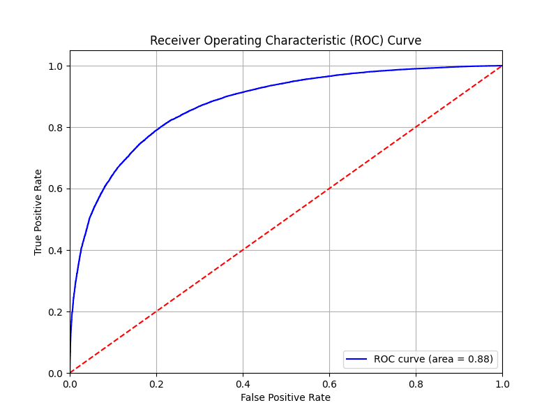

- Largement suffisant pour la détection de bad buzz  
- Déployable sur Heroku Free  
- Possibilité de réentraîner rapidement avec de nouvelles données  
- Pas de dépendances lourdes  

---

### Architecture du modèle retenu

**Pipeline complet** :

#### 1. Preprocessing_2
text  
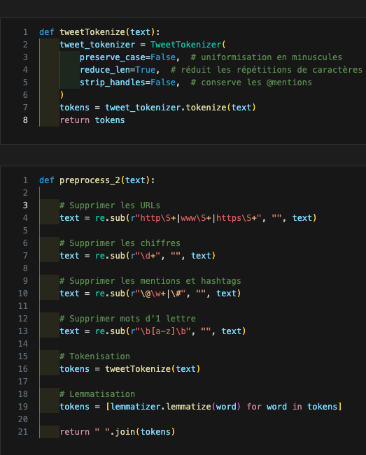

#### 2. Vectorisation TF-IDF
tokens → `TfidfVectorizer()`  
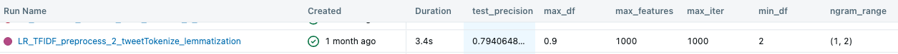

#### 3. Classification
vector → `LogisticRegression()`

---

### Sauvegarde et versioning

Pour comparer facilement les différentes expériences et identifier le modèle le plus adapté (comme vu précédemment), nous avons opté pour **MLflow**, qui permet de :

- **Suivre les expérimentations** : sauvegarde des runs d’entraînement avec leurs métriques et graphiques associés.  
- **Gérer un registre de modèles** : sauvegarde et versioning des modèles (par exemple, au format `joblib` pour le modèle LR_TFIDF).

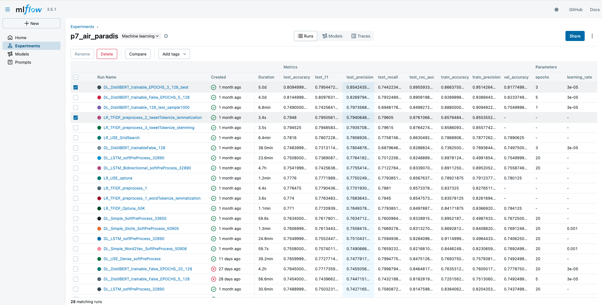

---

## Déploiement et production

### Architecture de production

**Stack technique** :
- **Backend** : FastAPI  
- **Modèle** : Scikit-learn (joblib)  
- **Serveur** : Uvicorn  
- **Conteneur** : Docker  
- **Hébergement** : Heroku  
- **Monitoring** : Azure Application Insights  
- **CI/CD** : GitHub Actions  

### Tests unitaires

Pour vérifier le bon fonctionnement de notre application, et avant chaque déploiement, une série de tests unitaires valide le comportement du modèle et de l’API.

#### Structure des tests
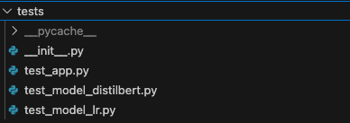

#### `test_model.py` : tests du modèle
Vérifie que le modèle se charge correctement et prédit de manière cohérente.  
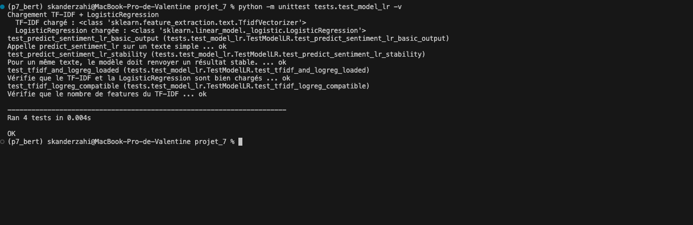

#### `test_api.py` : tests des endpoints
Vérifie que l'API répond correctement aux requêtes.  
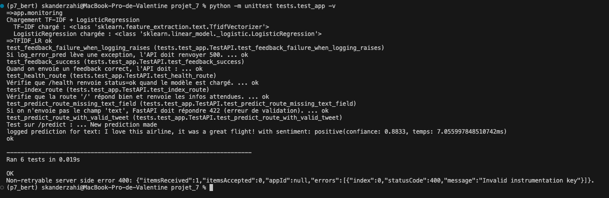

### Conteneurisation Docker

Dans notre projet, nous avons utilisé **Docker** pour packager l’application et ses dépendances dans un conteneur isolé. L’objectif est de garantir que le code fonctionne de manière identique en local et en production.  
Concrètement, nous construisons d’abord l’image Docker, puis nous la poussons dans le **Container Registry Heroku**, qui se charge ensuite de déployer et d’exécuter le conteneur.

Image pour les tests locaux + image poussée dans le Container Registry Heroku :  
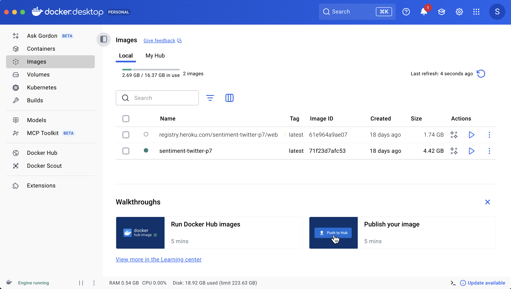

### Pipeline CI/CD avec GitHub Actions

Nous avons automatisé le déploiement via **GitHub Actions** pour garantir la qualité et la reproductibilité.  
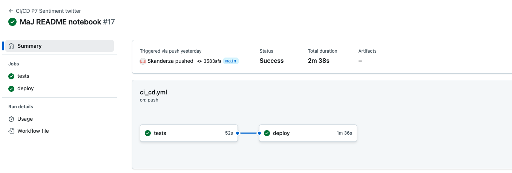

**Workflow :**
1. **Push sur `main`** → déclenchement automatique  
2. **Tests unitaires** : validation du modèle et de l'API  
3. **Build Docker** : construction de l'image  
4. **Push Heroku** : déploiement automatique  
5. **Health check** : vérification de l'API en production  

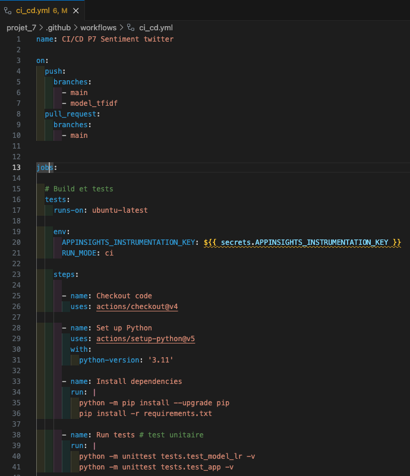

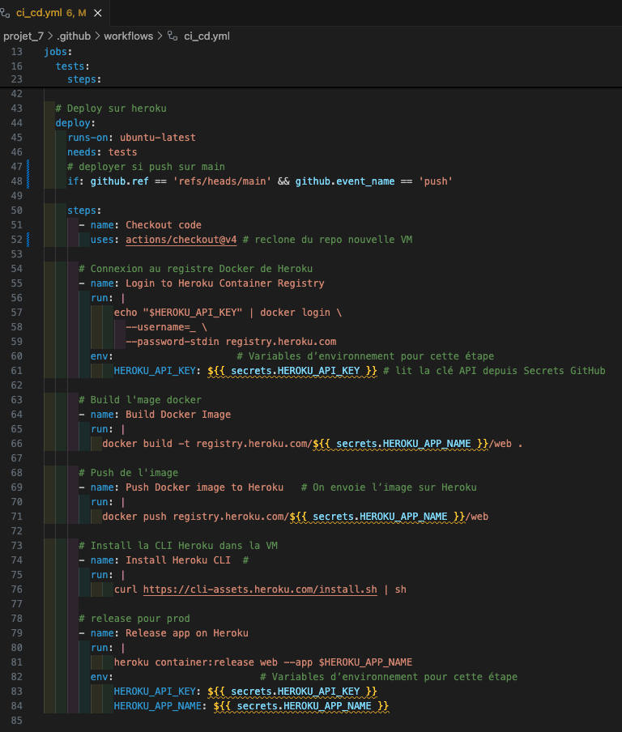

**Dockerfile** :  

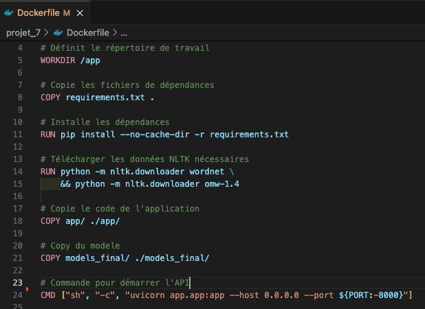

**Requirements** :  

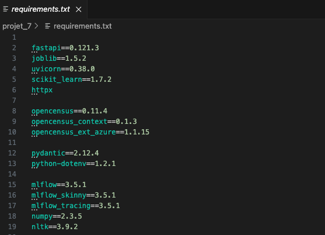

### Déploiement sur Heroku

**Commandes** :  

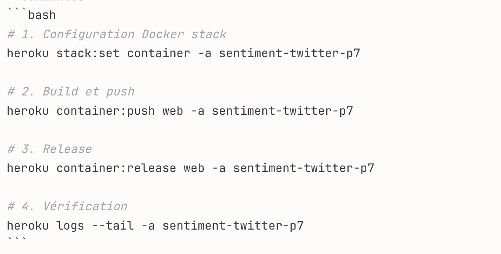

**URL production** :  
`https://sentiment-twitter-p7-357ab866923c.herokuapp.com/docs`

**Endpoints disponibles** :  

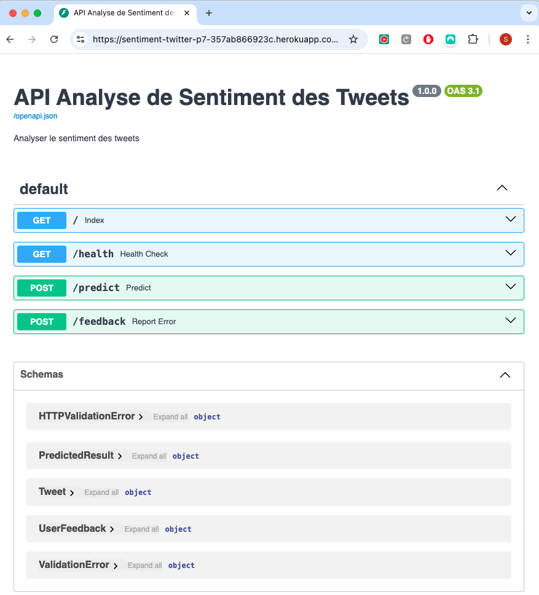

*Interface utilisateur Streamlit déployée*  

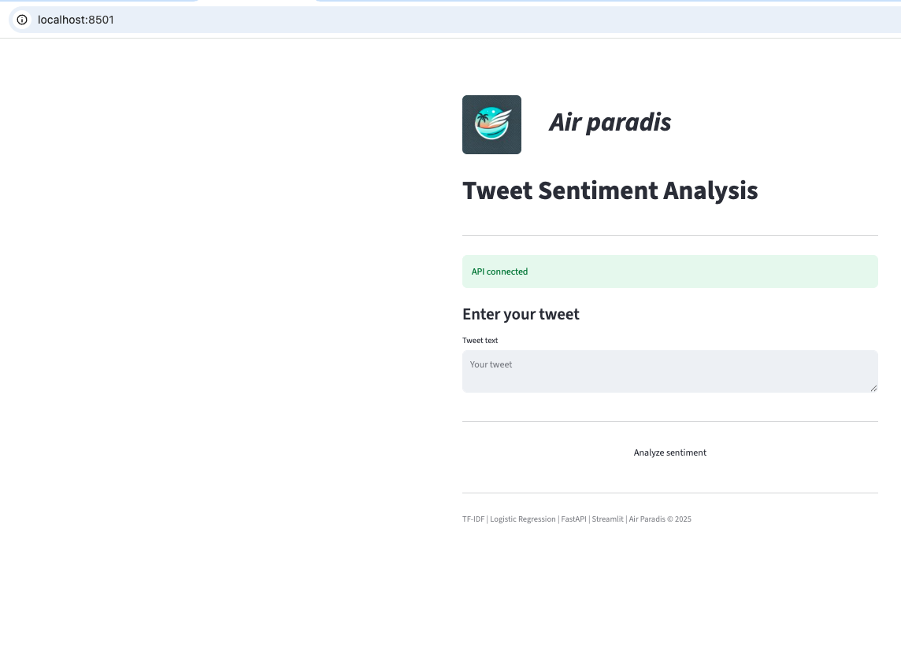

---

## Monitoring et alerting 

Pour surveiller les performances du modèle en production, nous avons mis en place un système de monitoring avec **Azure Application Insights**.

### Architecture du monitoring

1. **API FastAPI** : journalise les prédictions et les erreurs  
2. **Azure Application Insights** : collecte et agrège les logs  
3. **Alertes email** : notifications automatiques en cas d'anomalies  

À chaque appel, l’API envoie des logs personnalisés vers Application Insights.

### Métriques collectées

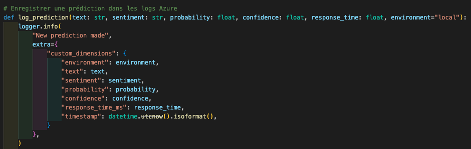

---

### Système de feedback utilisateur

**Endpoint `/feedback` dans `app.py` :**  

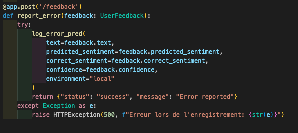

**Interface Streamlit** :

*Interface utilisateur : pouce de signalement d'erreur*  

*Exemple de prédiction positive avec feedback*  

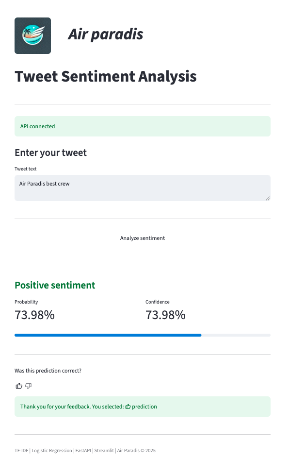

*Exemple de prédiction négative avec feedback*  

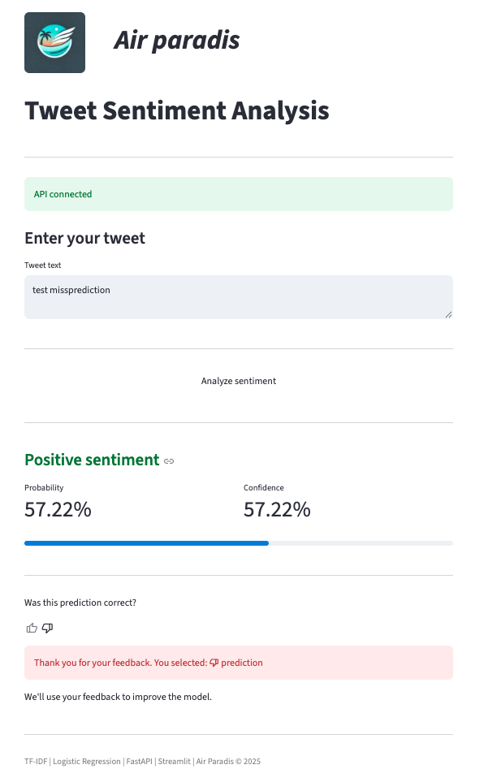

---

### Alertes automatiques

Les logs personnalisés sont stockés principalement dans la table `traces` d’Application Insights.  
Nous pouvons ensuite interroger ces données via des requêtes **KQL** pour analyser le comportement du système.

**Règle d'alerte définie pour notre besoin :**  
Si **> 3 mispredictions** sont signalées en 5 minutes → envoi automatique d’un email.

*Aperçu des alertes dans Azure*  

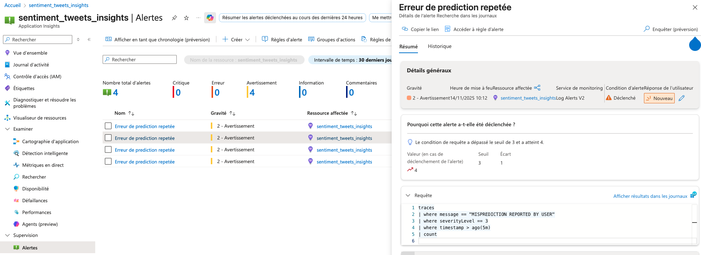

*Email reçu lors du déclenchement d'alerte*  

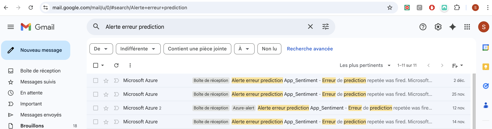

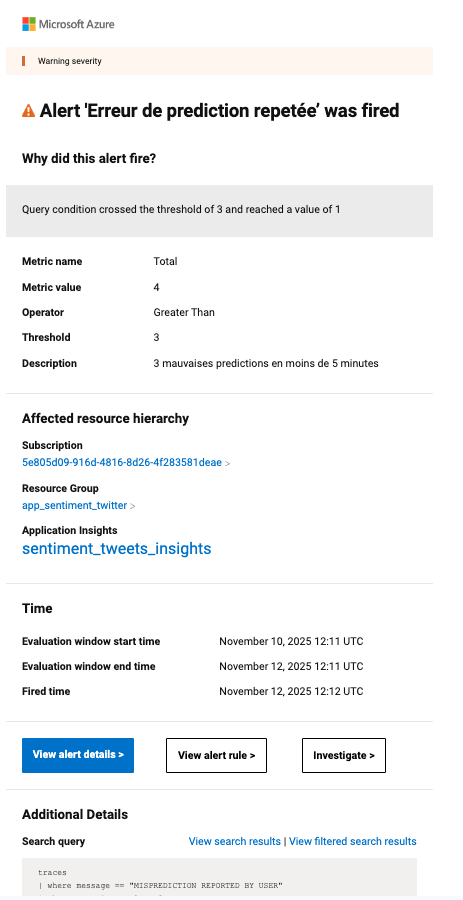

- Détection rapide d’une dégradation du modèle  
- Réactivité en cas de problème majeur

## Conclusion
Dans ce projet nous ne nous limitons pas uniquement à entraîner un modèle performant mais à concevoir un cas d'usage MLOps complet.

La première phase a consisté à explorer différentes approches de modèles (Régression logistique, LSTM, BiLSTM, DistilBERT) avec un suivi des expériences dans **MLflow**, afin de garder une traçabilité claire des choix et des performances.

Le modèle final n’a pas été guidée uniquement par l’accuracy ou la précision, mais aussi par des contraintes **opérationnelles** de déploiement (taille du modèle, limites Heroku).

La deuxième phase a porté sur l’industrialisation :  
- création d’une **API FastAPI** conteneurisée avec **Docker**,  
- mise en place d’une pipeline **CI/CD GitHub Actions** exécutant systématiquement les tests unitaires avant chaque déploiement,  
- déploiement automatisé sur **Heroku** à partir de l’image Docker.

Enfin, la troisième brique clé est le **monitoring en production** avec **Azure Application Insights** : logs de prédictions, système de feedback utilisateur, règles d’alerte sur les mauvaises prédictions. Ce processus transforme le modèle en un système vivant, observable, et améliorable dans le temps.

Axe d'améliorations:
- Pipelines de réentraînement automatique à partir de nouvelles données.
- Surveillance de la dérive des données (data drift),
- Infrastructure plus adaptée pour réintroduire des modèles plus lourds (DistilBERT)

Ce projet propose un produit IA de prédiction monitoré et déployé en continu, capable d’apporter une valeur ajoutée à Air Paradis.
